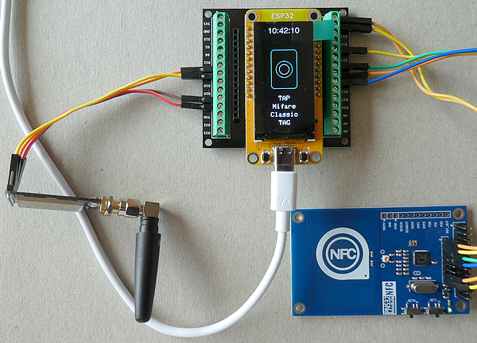
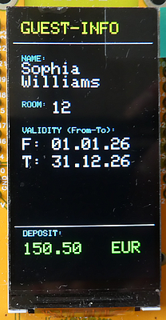
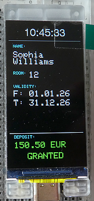
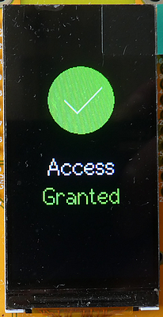

# ESP32 NFC meets LoRa

This repository accompanies the articles "**NFC meets LoRa - using Long Range Communication for Access Control Systems with ESP32**" published here:

This is not a tutorial, but rather a **proof-of-concept article** in which I will demonstrate how to combine two technologies. The first is **Near Field Communication (NFC)** - the technology used, for instance, when a hotel key card is held against a door reader to verify credentials and grant access to a room. The second is **Long Range Communication (LoRa)**, which is ideally suited for transmitting small amounts of data over significant distances (ranging from a few meters up to several kilometers). Both technologies share a common characteristic: they handle small data packets efficiently and have been optimized for energy efficiency.

### Sketch for the NFC Card Reader unit:

- Reader sketch: **[Esp32_Tft_ST7789_Adafruit_PN532_MifareClassic1K_LoRa_v08](./Esp32_Tft_ST7789_Adafruit_PN532_MifareClassic1K_LoRa_v08)** folder

### Sketch for the Controller unit:

- Controller sketch: **[Esp32_MultiDev_Sx12xx_Nfc_Rec_v05](./Esp32_MultiDev_Sx12xx_Nfc_Rec_v05)** folder



  

## Development Environment (Arduino)
````plaintext
Arduino IDE Version 2.3.8 (Windows)
arduino-esp32 boards Version 3.3.8 (https://github.com/espressif/arduino-esp32) that is based on Espressif ESP32 Version 5.5.1
````
